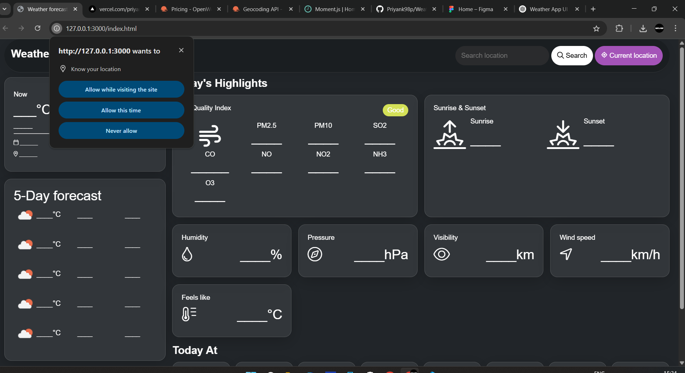
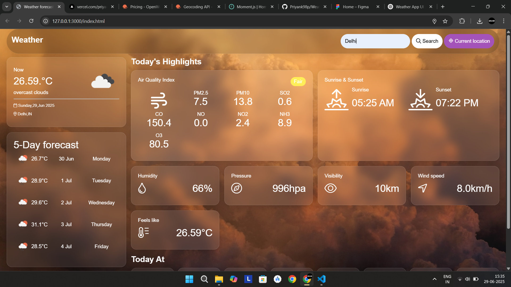

# 🌦️ Weather Forecast App

Stay one step ahead of the weather!  
This web app brings you real-time weather updates, a 5-day forecast, air quality index, and more — all powered by the OpenWeatherMap API.  
Built using **HTML, CSS, and JavaScript**, with a responsive and visually engaging UI.

---

## 📸 Preview

### 🔍 Home Page


### 🌤️ Weather Result


### 📱 Mobile View


---

## 🎯 Features at a Glance

### 🔍 Search Any City Instantly
Type in your favorite city and get current weather details including:
- Temperature
- Weather description and icon
- Sunrise and sunset time
- Location details

### 📍 Use Your Current Location
- Instantly fetch weather based on your current coordinates using the Geolocation API.
- Automatically displays weather and air quality index.

### 🌡️ Real-Time Weather Conditions
- Temperature in Celsius
- Weather icon and description
- Feels-like temperature
- Date and location shown with icons

### 🕓 Hourly Forecast (Next 8 Slots)
- Temperature for every 3 hours (~24 hrs ahead)
- Formatted time (e.g., 2 PM, 5 PM)
- Weather icons included

### 📅 5-Day Weather Forecast
- A clean view of upcoming days
- Each day includes:
  - Temperature
  - Date and Day
  - Weather icon

### 🌄 Sunrise and Sunset
- Accurate local times (timezone adjusted)
- Displayed with sunrise/sunset icons

### 🌬️ Air Quality Index (AQI)
- Live air quality rating (Good to Very Poor)
- Shows:
  - PM2.5
  - PM10
  - CO, NO, NO2, SO2, O3, NH3

### 📊 Other Weather Metrics
- Humidity (%)
- Atmospheric Pressure (hPa)
- Visibility (km)
- Wind Speed (km/h)

---

## 🧪 Demo

Live demo: [🌐 Weather Forecast App](https://weather-forecast-app-rose-five.vercel.app/)  
_(Replace with your deployed link)_

---

## 🛠️ Tech Stack

| Tech         | Purpose                        |
|--------------|--------------------------------|
| HTML5        | Structure of the app           |
| CSS3         | Styling and responsive layout  |
| JavaScript   | Core logic, API handling       |
| Moment.js    | Time and timezone formatting   |
| OpenWeatherMap API | Weather, forecast, AQI   |

---

## 📂 Folder Structure

```
📁 WeatherApp/
├── index.html
├── style.css
├── script.js
├── screenshot.png
├── /images
│   ├── clear.png
│   ├── thunderstorm.png
│   ├── mist.png
│   ├── cloudy.png
│   ├── night.png
│   ├── snow.png
│   ├── rain.png
│   └── cloud at night.png
```

---

## ⚙️ API Setup

1. Create a free account on [OpenWeatherMap](https://openweathermap.org/api)
2. Copy your API key.
3. Open `script.js` and replace:
   ```js
   const api_key = "YOUR_API_KEY_HERE";
   ```

---

## 📱 Responsive Design

- ✅ Works on all devices: desktop, tablet, and mobile
- ✅ Uses CSS media queries for layout adjustments
- ✅ Clean and accessible UI

---

## 🔐 Permissions

- You’ll be prompted for location access if using the current location feature.
- If denied, a fallback city search is always available.

---

## 💡 Future Improvements

- Toggle between °C and °F
- Add favorite cities and save them
- Use `localStorage` to remember last searched city
- Add animated backgrounds (e.g., raining, snowing)

---

## 📃 License

MIT License — free to use, modify, and share.

---

> 🌟 If you like this project, consider giving it a star!
